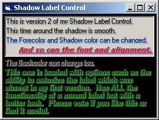



## \_ Shadow Label Control \(Version 2\)

### Description

Version 2 of my 3D Label control. The shadows are now smooth and very professional looking. Easy to use control. Works exactly like a normal label but this one looks better. Vote if you like it please!
 
### More Info
 

             |
---                |---
**Submitted On**   |2004-06-07 01:12:00
**By**             |[KRYO\_11](https://github.com/Planet-Source-Code/PSCIndex/blob/master/ByAuthor/kryo-11.md)
**Level**          |Intermediate
**User Rating**    |4.9 (59 globes from 12 users)
**Compatibility**  |VB 5\.0, VB 6\.0
**Category**       |[Custom Controls/ Forms/  Menus](https://github.com/Planet-Source-Code/PSCIndex/blob/master/ByCategory/custom-controls-forms-menus__1-4.md)
**World**          |[Visual Basic](https://github.com/Planet-Source-Code/PSCIndex/blob/master/ByWorld/visual-basic.md)
**Archive File**   |[\_\_Shadow\_L175463672004\.zip](https://github.com/Planet-Source-Code/kryo-11-shadow-label-control-version-2__1-54226/archive/master.zip)

